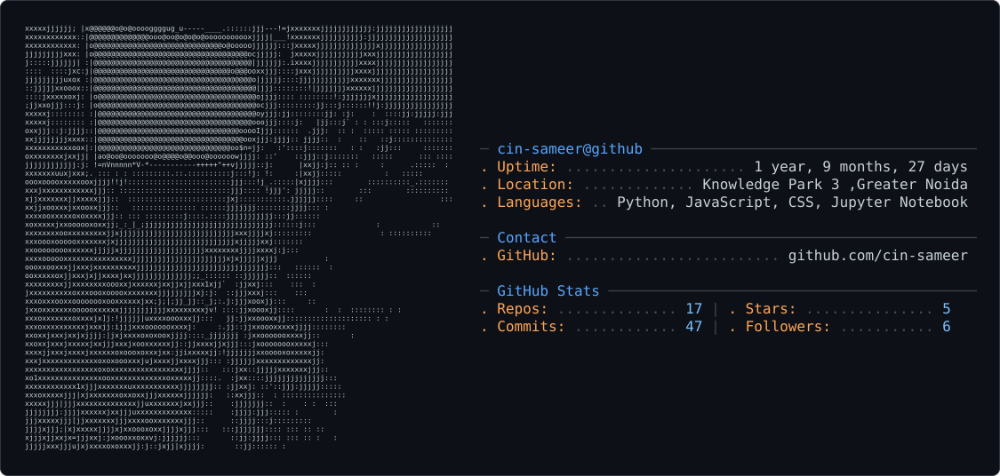

# 👋 Hi, I'm Sameer
Portfolio:https://my-portfolio-eight-pink-20.vercel.app/

### 🎓 3rd-Year CSE (AIML) Undergrad |  AI/ML Engineer in the Making |  GSSoC'25 Contributor

---
<picture>
  <source media="(prefers-color-scheme: dark)" srcset="dark_mode.svg" />
  <source media="(prefers-color-scheme: light)" srcset="light_mode.svg" />
  
</picture>
##  About Me

-  Currently building **agentic AI systems** , multi-agent pipelines, RAG, and LLM-powered tools
-  Deep hands-on experience with **LLMs, LangChain, LangGraph, PyTorch, ChromaDB, SentenceTransformers**
-  Open-source contributor at **GirlScript Summer of Code (GSSoC'25)**
-  Actively looking for **AI/ML internships** (remote or India-based) , targeting AI-native startups over generic SWE roles
---

## 🛠️ Featured Projects

### 🔍 Multi-Agent Code Review System
Parallel specialist agents (security, style, logic) built with **LangGraph's Send API**, each backed by its own **RAG collection** in ChromaDB, powered by **Groq** for fast inference. Successfully ran on a real GitHub PR.
`LangGraph` `ChromaDB` `SentenceTransformers` `Groq` `RAG`

### 📄 AI Resume Screener
Semantic resume-job matching using **SBERT (all-MiniLM-L6-v2)** with a 3-label classification system (Fit / Partial Fit / Not Fit), trained on a 120-pair labeled dataset across IT, Teacher, and Designer roles.
`SBERT` `NLP` `Classification` `Pydantic`

---

## 🧰 Tech Stack

**Languages & Core**

**AI / ML**

**Tools**

---

## 📊 GitHub Stats

  
  

  

## 🧩 LeetCode Stats

  

---

## 🌐 Connect With Me

---

<i>Building agents, breaking bugs, shipping stuff. 🚀</i>

